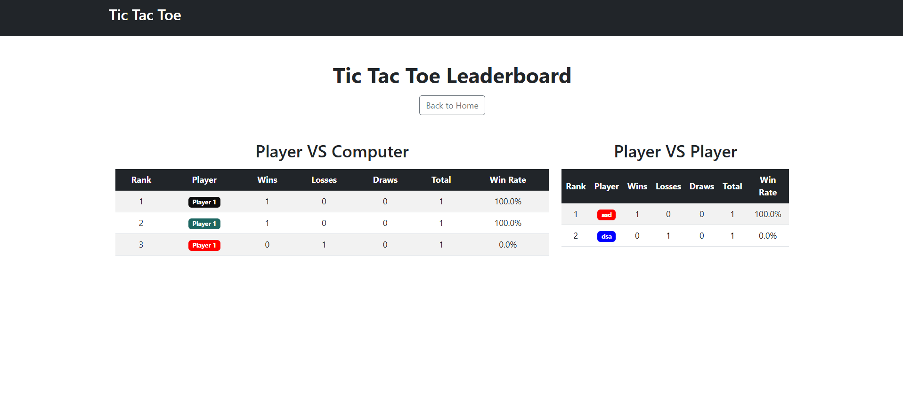

# 🎮 Tic-Tac-Toe ASP.NET Core Game

Welcome to the **Tic-Tac-Toe** game! This project is built with ASP.NET Core, offering two fun game modes and a competitive leaderboard. Challenge your friends or test your skills against the computer!

## 🌟 Features

- **Two Game Modes:**
  - Player vs. Computer 🖥️
  - Player vs. Player (Local Multiplayer) 👥
- **Leaderboard:**
  - Tracks your wins and displays top players.
- **Responsive UI:**
  - Enjoy the game on desktop, tablet, or mobile devices.

## 🚀 Live Demo

[Play TicTacToe now!](http://morskishah.somee.com/)  
*Click the link to start your first match!*  

## 🎮 How to Play

1. **Select a game mode:**
   - Play against a smart computer opponent.
   - Play locally with a friend.
2. **Take turns:**
   - Player 1: X  
   - Player 2 / Computer: O
3. **Win the game:**
   - Be the first to get three of your marks in a row, column, or diagonal!

## 🛠️ Technology Stack

- **Frontend:** Razor Pages, HTML, CSS
- **Backend:** ASP.NET Core MVC
- **Database:** SQLite (for leaderboard)
- **Languages:** C#, JavaScript

## 📸 Screenshots

| Home Screen | Game Board | Leaderboard |
|-------------|------------|-------------|
|  |  |  |

## ⚙️ Installation

Follow these steps to run the game locally:

1. **Clone the repository:**
   ```bash
   git clone https://github.com/your-repo/tictactoe-aspnetcore.git
   ```
2. **Navigate to the project folder:**
   ```bash
   cd tictactoe-aspnetcore
   ```
3. **Restore dependencies:**
   ```bash
   dotnet restore
   ```
4. **Run the application:**
   ```bash
   dotnet run
   ```
5. **Open in your browser:**
   Go to `http://localhost:5000` to start playing!
---

Enjoy playing Tic-Tac-Toe! If you encounter any issues or have suggestions, feel free to open an issue in the repository. Happy gaming! 🎉